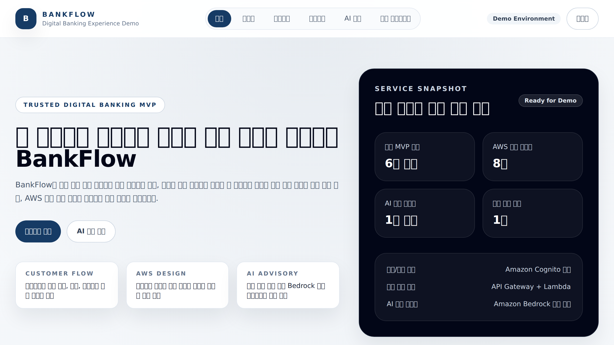
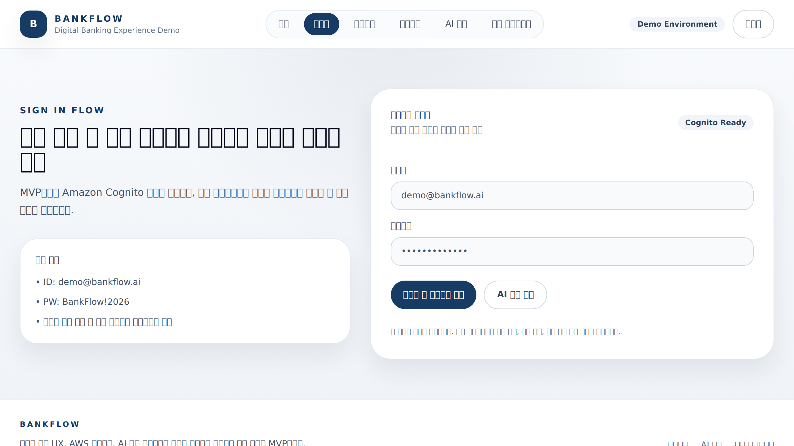
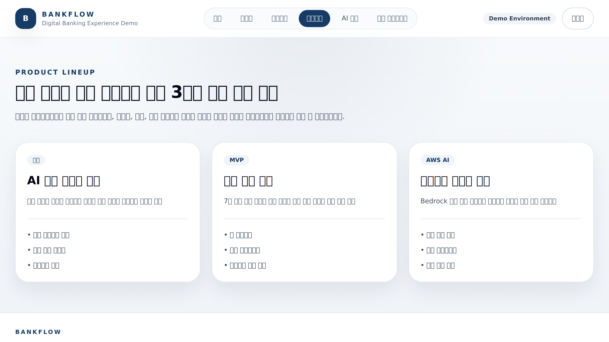
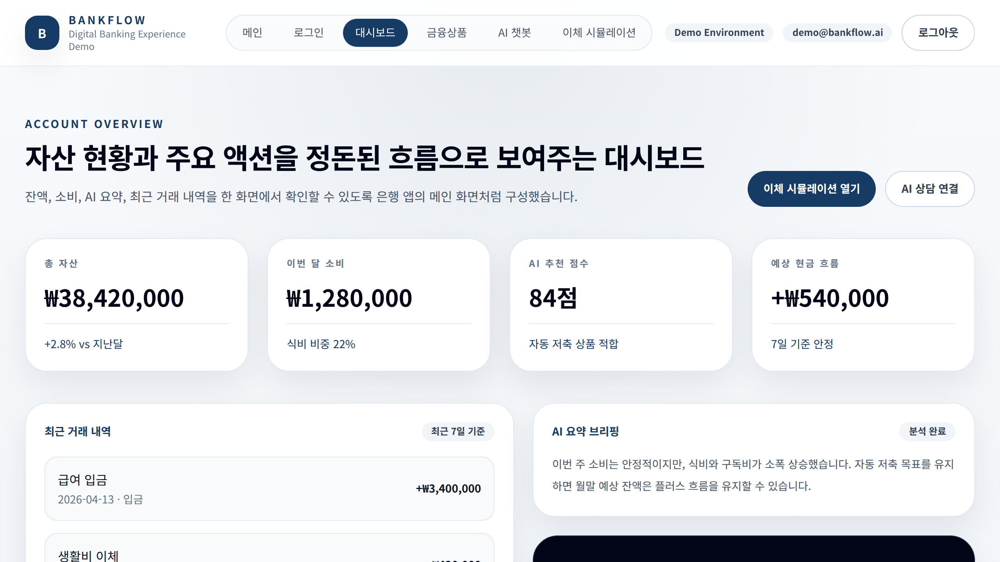
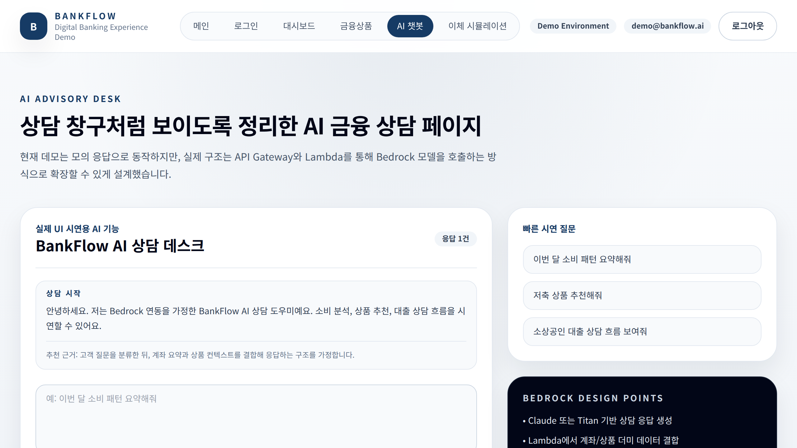
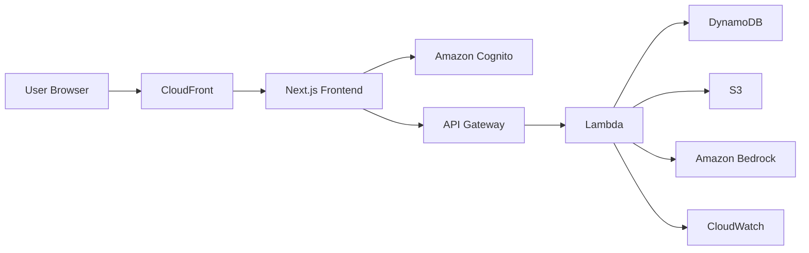
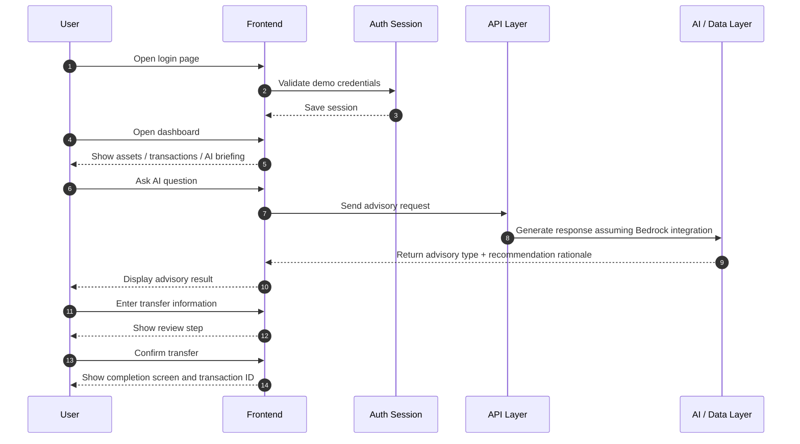

# BankFlow

[한국어](./README.md) | [English](./README.en.md)


> **A finance service MVP designed to demonstrate a trustworthy digital banking experience**  
> This project showcases AWS architecture understanding, AI advisory UX design, and an executable frontend implementation.

BankFlow is a demo website designed to present the **core user flows of a banking service in a realistic and persuasive way**, instead of implementing a full financial core system.

The main goals of this project are:

- **Define a realistic MVP scope** that can be implemented within one week
- **Demonstrate AWS architecture understanding** by separating authentication, API, data, and AI layers
- **Show AI resource utilization** through an Amazon Bedrock-based advisory UX concept
- **Deliver an executable demo** including login, dashboard, advisory, and transfer flows

---

## Screenshots

<table>
  <tr>
    <td><b>Home</b></td>
    <td><b>Login</b></td>
    <td><b>Products</b></td>
  </tr>
  <tr>
    <td></td>
    <td></td>
    <td></td>
  </tr>
  <tr>
    <td><b>Dashboard</b></td>
    <td><b>AI Chat</b></td>
    <td><b>Transfer</b></td>
  </tr>
  <tr>
    <td></td>
    <td></td>
    <td></td>
  </tr>
</table>

---

## Key Features

### 1) Landing Page
- Overview of the service and demo highlights
- Summary of AWS resource composition
- Preview of featured financial products
- Calm, trustworthy visual tone inspired by banking services

### 2) Login Page
- Demo account-based login UI
- Structure explained as if integrated with Amazon Cognito
- Input validation and error message display
- localStorage-based session persistence
- Protected page access control

### 3) User Dashboard
- Total assets, spending, AI recommendation score, expected cash flow
- Recent transaction summary
- AI briefing and recommended actions

### 4) Product Page
- Deposit / checking product
- Savings product
- Loan advisory product
- Product-specific highlights and presentation points

### 5) AI Advisory Chatbot
- Quick prompt buttons
- Branching scenarios for spending analysis, savings recommendation, and loan advisory
- Loading state while generating responses
- Advisory type labels
- Recommendation rationale / analysis basis display
- Architecture explained as if integrated with Bedrock

### 6) Transfer Simulator
- Input for source account, recipient, amount, and memo
- Minimum transfer amount and insufficient balance validation
- **Input → Review → Complete** 3-step flow
- Completion screen with transaction ID and timestamp

---

## Demo Account

Use the following account for presentation and demo purposes.

- **ID**: `demo@bankflow.ai`
- **PW**: `BankFlow!2026`

Protected pages available after login:

- `/dashboard`
- `/ai-chat`
- `/transfer`

If a non-authenticated user tries to access a protected page, the app redirects to `/login`.

---

## Tech Stack

- **Frontend**: Next.js 14, TypeScript, Tailwind CSS
- **State / UI**: React Client Components, localStorage-based demo session
- **Data**: Dummy data-driven rendering
- **Architecture**: AWS-oriented design
- **AI**: Amazon Bedrock integration assumed, currently implemented with mock responses

---

## System Architecture



### Summary

- **CloudFront / Route 53**: Entry point for domain routing and frontend delivery
- **Next.js Frontend**: Renders the user-facing UI
- **Amazon Cognito**: Assumed authentication / session handling
- **API Gateway**: Entry point for frontend API requests
- **AWS Lambda**: Business logic layer
- **Amazon DynamoDB**: Stores dummy user and transaction data
- **Amazon S3**: Stores static assets and reports
- **Amazon Bedrock**: Generates AI advisory responses
- **Amazon CloudWatch**: Tracks logs and errors

---

## Main User Flow



### Page-by-page Flow

#### Login
1. User opens the login page
2. User enters demo credentials
3. Input validation and login processing are executed
4. On success, session is stored and protected pages become accessible

#### Dashboard
1. Authenticated user opens the dashboard
2. Reviews asset summary, transactions, and AI briefing
3. Moves to AI advisory or transfer simulator

#### AI Chatbot
1. User enters a question or clicks a quick prompt
2. The question is classified into spending analysis, savings recommendation, loan advisory, or general guidance
3. Advisory type and recommendation rationale are displayed together
4. In a production structure, this can be extended via API Gateway, Lambda, and Bedrock

#### Transfer Simulator
1. User enters account, recipient, amount, and memo
2. Minimum amount and balance validation are performed
3. Review step shows amount, expected balance, and fee
4. Completion step shows transaction result and transaction ID

---

## Routes

- `/` Landing page
- `/login` Login
- `/dashboard` User dashboard (protected)
- `/products` Product overview
- `/ai-chat` AI advisory chatbot (protected)
- `/transfer` Transfer simulator (protected)

---

## Local Run

### Development server
```bash
npm install
npm run dev
```

### Recommended run for presentation / demo
```bash
npm install
npm run build
npm run start
```

Default URL:
- `http://localhost:3000`

> Note: `next start` is more stable than `next dev` for demo environments.

---

## Project Structure

```bash
BankFlow/
├─ docs/
│  ├─ project-overview.md
│  ├─ aws-architecture.md
│  ├─ ai-features.md
│  ├─ test-report.md
│  └─ screenshots/
├─ src/
│  ├─ app/
│  │  ├─ ai-chat/
│  │  ├─ dashboard/
│  │  ├─ login/
│  │  ├─ products/
│  │  ├─ transfer/
│  │  ├─ globals.css
│  │  ├─ layout.tsx
│  │  └─ page.tsx
│  ├─ components/
│  │  ├─ ai-chat-panel.tsx
│  │  ├─ auth-provider.tsx
│  │  ├─ dashboard-card.tsx
│  │  ├─ login-form.tsx
│  │  ├─ protected-route.tsx
│  │  ├─ site-header.tsx
│  │  └─ transfer-simulator.tsx
│  └─ data/
│     ├─ auth.ts
│     └─ demo.ts
├─ package.json
├─ README.md
└─ README.en.md
```

---

## Documentation

- [`docs/project-overview.md`](./docs/project-overview.md)
- [`docs/aws-architecture.md`](./docs/aws-architecture.md)
- [`docs/ai-features.md`](./docs/ai-features.md)
- [`docs/test-report.md`](./docs/test-report.md)

---

## Test and Validation

The main validation commands used for this project are:

```bash
npm install
npm run lint
npm run build
```

The following command was also verified for stable presentation use:

```bash
npm run start
```

### Validation checklist
- Landing page rendering
- Login validation and session persistence
- Protected route access control
- Dashboard data rendering
- Product card rendering
- AI advisory type / rationale display
- Transfer simulator input / review / completion flow

### Result
- `npm install`: success
- `npm run lint`: success
- `npm run build`: success
- `npm run start`: runnable

---

## Presentation Highlights

1. Explain **why the scope was intentionally reduced to a 1-week MVP**
2. Describe the **AWS resource connection structure** using the README and docs
3. Show **protected page access after login** to demonstrate service flow understanding
4. Demonstrate **AI advisory type and rationale** directly in the chatbot UI
5. Emphasize implementation stability through the **review / completion transfer flow**

---

## Future Improvements

- Real Amazon Cognito integration
- Actual Lambda + Bedrock API connection
- Transaction history API
- Mobile-first UI optimization
- Admin monitoring interface
- Operational / security improvements such as WAF, Guardrails, and CloudWatch alarms
