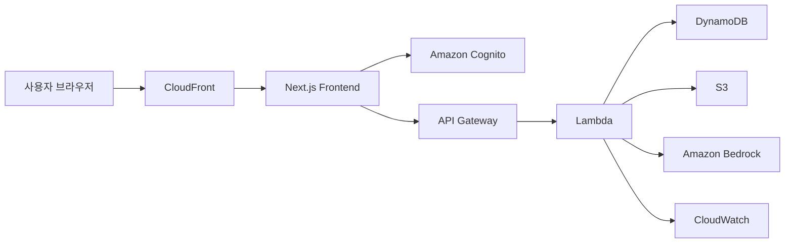

# BankFlow

> **신뢰감 있는 디지털 뱅킹 경험을 시연하기 위한 금융 서비스 MVP**  
> AWS 아키텍처 이해도, AI 상담 시나리오 구성 능력, 실행 가능한 프론트엔드 구현을 함께 보여주기 위한 프로젝트입니다.

## 1. 프로젝트 소개

BankFlow는 실제 금융 코어 시스템 전체를 구현하는 대신, **금융 서비스의 핵심 사용자 경험**을 차분하고 설득력 있게 시연할 수 있도록 설계한 데모 웹사이트입니다.

이 프로젝트는 아래 4가지를 중심으로 구성했습니다.

- **프로젝트 범위 정의**: 1주 MVP 기준의 현실적인 화면과 기능 구성
- **AWS 아키텍처 설명력**: 인증, API, 데이터, AI 연결 구조 제시
- **AI 리소스 활용**: Amazon Bedrock 기반 상담 UX 시나리오 시연
- **구현 안정성**: 로그인, 대시보드, 상담, 이체 흐름이 실제로 동작하는 화면 제공

---

## 2. 현재 구현 범위

### 포함 범위
- 메인 페이지
- 로그인 페이지
- 사용자 대시보드
- 금융상품 소개 페이지
- AI 챗봇 페이지
- 이체 시뮬레이션 페이지
- AWS 아키텍처 문서
- AI 기능 설계 문서
- 테스트 보고서

### 제외 범위
- 실제 금융기관 API 연동
- 실명 인증 및 계좌 개설
- 실거래 송금/결제
- 운영용 관리자 백오피스
- 실제 Bedrock 운영 연동

---

## 3. 주요 기능

### 3-1. 메인 페이지
- 금융 서비스 데모 목적과 핵심 가치 제안
- 1주 MVP 범위 요약
- AWS 리소스 구성 요약
- 대표 금융상품 미리보기
- 은행 서비스 톤에 맞춘 안정적인 비주얼 구성

### 3-2. 로그인 페이지
- 데모 계정 기반 로그인 UI
- Amazon Cognito 연동을 가정한 흐름 설명
- 입력값 검증 및 로그인 실패 메시지 표시
- 세션 유지(localStorage 기반)
- 로그인 후 보호 페이지 접근 가능

### 3-3. 사용자 대시보드
- 총 자산
- 이번 달 소비
- AI 추천 점수
- 예상 현금 흐름
- 최근 거래 내역
- AI 브리핑 요약
- 추천 액션 패널

### 3-4. 금융상품 소개
- 입출금 상품
- 적금 상품
- 대출 상담 상품
- 상품별 핵심 특징 정리

### 3-5. AI 챗봇
- 금융 상담 채팅 UI
- 빠른 질문 버튼 제공
- 소비 분석, 저축 추천, 대출 상담 시나리오 응답
- 응답 생성 중 상태 표시
- 상담 유형 라벨 표시
- 답변별 추천 근거/분석 기준 표시
- Bedrock 연동을 가정한 구조 설명

### 3-6. 이체 시뮬레이션
- 출금 계좌 선택
- 수취 대상 선택
- 이체 금액 입력
- 메모 입력
- 최소 금액 및 잔액 부족 검증
- **입력 → 확인 → 완료** 3단계 흐름
- 거래 번호와 완료 시각이 포함된 완료 화면 제공

---

## 4. 데모 계정

발표 및 시연용 계정은 아래와 같습니다.

- **ID**: `demo@bankflow.ai`
- **PW**: `BankFlow!2026`

로그인 후 아래 페이지에 접근할 수 있습니다.

- `/dashboard`
- `/ai-chat`
- `/transfer`

로그인하지 않은 상태에서 보호 페이지에 접근하면 `/login`으로 이동합니다.

---

## 5. 기술 스택

- **Frontend**: Next.js 14, TypeScript, Tailwind CSS
- **State/UI**: React Client Components, localStorage 기반 데모 세션
- **Data**: 더미 데이터 기반 렌더링
- **Architecture**: AWS 중심 설계
- **AI**: Amazon Bedrock 연동 가정, 현재는 모의 응답 기반 UI 구현

---

## 6. 시스템 아키텍처



### 아키텍처 설명
- **CloudFront / Route 53**: 도메인 연결 및 프론트엔드 배포 진입점
- **Next.js Frontend**: 사용자 화면 렌더링
- **Amazon Cognito**: 로그인/인증 처리 가정
- **API Gateway**: 프론트엔드 요청 진입점
- **Lambda**: 비즈니스 로직 처리
- **DynamoDB**: 사용자/거래 더미 데이터 저장
- **S3**: 정적 자산 및 리포트 저장
- **Bedrock**: AI 상담 응답 생성
- **CloudWatch**: 로그 및 오류 추적

---

## 7. 화면별 동작 흐름

### 로그인
1. 사용자가 로그인 페이지 접속
2. 데모 계정 정보 입력
3. 입력값 검증 및 로그인 처리
4. 성공 시 세션 저장 후 보호 페이지 접근 가능

### 대시보드
1. 로그인된 사용자가 대시보드 접근
2. 자산 요약, 거래 내역, AI 브리핑 확인
3. AI 상담 또는 이체 시뮬레이션으로 이동

### AI 챗봇
1. 사용자가 질문 입력 또는 빠른 질문 선택
2. 질문 의도에 따라 소비 분석 / 저축 추천 / 대출 상담 분기
3. 상담 유형과 추천 근거를 함께 표시
4. 실제 구조에서는 API Gateway, Lambda, Bedrock으로 확장 가능

### 이체 시뮬레이션
1. 계좌, 수취인, 금액, 메모 입력
2. 최소 금액과 잔액 검증 수행
3. 확인 단계에서 금액, 예상 잔액, 수수료 확인
4. 완료 단계에서 거래 번호와 결과 표시

---

## 8. 실행 방법

### 개발 서버
```bash
npm install
npm run dev
```

### 발표/시연용 권장 실행
```bash
npm install
npm run build
npm run start
```

기본 실행 주소:
- `http://localhost:3000`

> 참고: 시연 환경에서는 `next dev`보다 `next start`가 더 안정적입니다.

---

## 9. 페이지 경로

- `/` 메인 페이지
- `/login` 로그인
- `/dashboard` 사용자 대시보드 (보호 페이지)
- `/products` 금융상품 소개
- `/ai-chat` AI 챗봇 (보호 페이지)
- `/transfer` 이체 시뮬레이션 (보호 페이지)

---

## 10. 프로젝트 구조

```bash
BankFlow/
├─ docs/
│  ├─ project-overview.md
│  ├─ aws-architecture.md
│  ├─ ai-features.md
│  └─ test-report.md
├─ src/
│  ├─ app/
│  │  ├─ ai-chat/
│  │  ├─ dashboard/
│  │  ├─ login/
│  │  ├─ products/
│  │  ├─ transfer/
│  │  ├─ globals.css
│  │  ├─ layout.tsx
│  │  └─ page.tsx
│  ├─ components/
│  │  ├─ ai-chat-panel.tsx
│  │  ├─ auth-provider.tsx
│  │  ├─ dashboard-card.tsx
│  │  ├─ login-form.tsx
│  │  ├─ protected-route.tsx
│  │  ├─ site-header.tsx
│  │  └─ transfer-simulator.tsx
│  └─ data/
│     ├─ auth.ts
│     └─ demo.ts
├─ package.json
└─ README.md
```

---

## 11. 문서

- [`docs/project-overview.md`](./docs/project-overview.md)
- [`docs/aws-architecture.md`](./docs/aws-architecture.md)
- [`docs/ai-features.md`](./docs/ai-features.md)
- [`docs/test-report.md`](./docs/test-report.md)

---

## 12. 테스트 결과

다음 항목을 기준으로 동작을 확인했습니다.

- `npm install` 성공
- `npm run lint` 성공
- `npm run build` 성공

현재 구현 화면은 로컬에서 실제로 실행 가능하며,
- 메인 페이지
- 로그인 페이지
- 보호 페이지 접근 제어
- AI 상담 흐름
- 이체 확인/완료 흐름

이 모두 정상 동작하도록 구성했습니다.

---

## 13. 발표 포인트

1. **왜 1주 MVP 범위로 축소했는지** 먼저 설명
2. **AWS 리소스 연결 구조**를 README와 문서로 설명
3. **로그인 후 보호 페이지 접근 흐름**으로 서비스 구조 이해도 강조
4. **AI 챗봇 화면**에서 상담 유형과 추천 근거를 함께 시연
5. **이체 시뮬레이션**의 확인/완료 단계로 구현 안정성 강조

---

## 14. 향후 개선 방향

- 실제 Cognito 로그인 연동
- Lambda + Bedrock 실제 API 연결
- 거래내역 조회 API 추가
- 모바일 화면 최적화
- 관리자 모니터링 화면 확장
- WAF, Guardrails, Alarm 등 운영/보안 구조 보강
