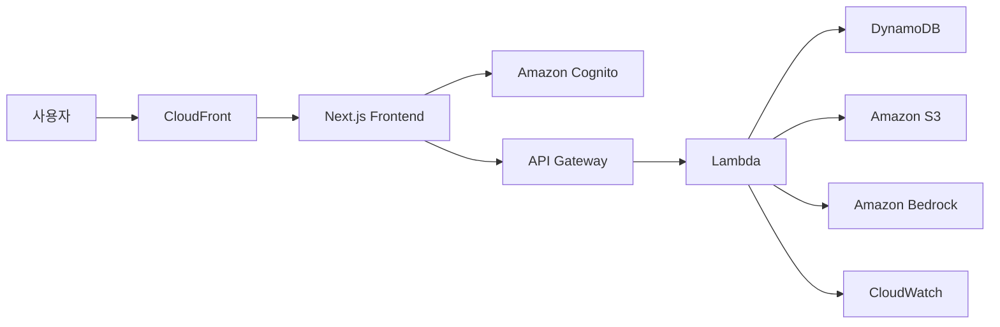

# BankFlow

> **1주일 안에 완성 가능한 금융/은행 서비스 데모 웹사이트**  
> AWS 아키텍처 설계 능력, AI 리소스 활용 능력, 실행 가능한 MVP 구현을 함께 보여주기 위한 프로젝트입니다.

## 1. 프로젝트 소개

BankFlow는 실제 금융 코어 시스템 전체를 구현하는 대신, **금융 서비스의 핵심 사용자 경험**을 빠르게 시연할 수 있도록 설계한 데모 웹사이트입니다.

평가 기준에 맞춰 아래 4가지를 중심으로 구성했습니다.

- **프로젝트 개요**: 1주 개발 기준의 현실적인 범위 정의
- **AWS 아키텍처**: 리소스 구성과 연결 관계 설명
- **AI 리소스 활용**: Amazon Bedrock 기반 상담 기능 시연
- **구현 모듈 안정성**: 실제 실행 가능한 화면과 테스트 결과 제공

---

## 2. 개발 목표

### 포함 범위
- 메인 페이지
- 로그인 페이지
- 사용자 대시보드
- 금융상품 소개 페이지
- AI 챗봇 페이지
- 이체 시뮬레이션 페이지
- AWS 아키텍처 문서
- AI 기능 설계 문서
- 테스트 보고서

### 제외 범위
- 실제 금융기관 API 연동
- 실명 인증 및 계좌 개설
- 실거래 송금/결제
- 운영용 관리자 백오피스
- 실제 Bedrock 운영 연동

---

## 3. 주요 기능

### 3-1. 메인 페이지
- 서비스 소개 및 핵심 가치 제안
- 1주 MVP 범위 요약
- AWS 리소스 구성 요약
- 대표 금융상품 미리보기

### 3-2. 로그인 페이지
- 데모 계정 기반 로그인 UI
- Amazon Cognito 연동을 가정한 흐름 설명
- 발표 시 바로 대시보드로 이동 가능한 구조

### 3-3. 사용자 대시보드
- 총 자산
- 이번 달 소비
- AI 추천 점수
- 예상 현금 흐름
- 최근 거래 내역
- AI 브리핑 요약

### 3-4. 금융상품 소개
- 입출금 상품
- 적금 상품
- 대출 상담 상품
- 상품별 핵심 특징 정리

### 3-5. AI 챗봇
- 금융 상담 채팅 UI
- 빠른 질문 버튼 제공
- 소비 분석, 저축 추천, 대출 상담 시나리오 응답
- Bedrock 연동을 가정한 구조 설명

### 3-6. 이체 시뮬레이션
- 출금 계좌 선택
- 수취 대상 선택
- 이체 금액 입력
- 금액 유효성 검사
- 제출 결과 메시지 표시

---

## 4. 기술 스택

- **Frontend**: Next.js 14, TypeScript, Tailwind CSS
- **Data**: 더미 데이터 기반 렌더링
- **Architecture**: AWS 중심 설계
- **AI**: Amazon Bedrock 연동 가정, 현재는 모의 응답 기반 UI 구현

---

## 5. 시스템 아키텍처



### 아키텍처 설명
- **CloudFront**: 프론트엔드 배포 콘텐츠 제공
- **Next.js Frontend**: 사용자 UI 렌더링
- **Cognito**: 로그인/인증 처리 가정
- **API Gateway**: API 요청 진입점
- **Lambda**: 비즈니스 로직 처리
- **DynamoDB**: 사용자/거래 더미 데이터 저장
- **S3**: 정적 파일 및 리소스 저장
- **Bedrock**: AI 상담 응답 생성
- **CloudWatch**: 로그 및 모니터링

---

## 6. AI 기능 설명

이 프로젝트의 핵심 AI 기능은 **금융 상담 챗봇**입니다.

### 시연 가능한 질문 예시
- 이번 달 소비 패턴 요약해줘
- 저축 상품 추천해줘
- 소상공인 대출 상담 흐름 보여줘

### 현재 구현 방식
- 사용자 입력
- 키워드 기반 응답 분기
- 채팅 UI에 즉시 결과 출력

### 확장 방향
- Lambda를 통해 Bedrock 호출
- 사용자 금융 컨텍스트 기반 프롬프트 생성
- 상담 기록 저장 및 개인화 추천 확장

---

## 7. 실행 방법

```bash
npm install
npm run dev
```

기본 실행 주소:
- `http://localhost:3000`
- 포트가 사용 중이면 `3001` 등으로 자동 변경

---

## 8. 페이지 경로

- `/` 메인 페이지
- `/login` 로그인
- `/dashboard` 사용자 대시보드
- `/products` 금융상품 소개
- `/ai-chat` AI 챗봇
- `/transfer` 이체 시뮬레이션

---

## 9. 프로젝트 구조

```bash
BankFlow/
├─ docs/
│  ├─ project-overview.md
│  ├─ aws-architecture.md
│  ├─ ai-features.md
│  └─ test-report.md
├─ src/
│  ├─ app/
│  │  ├─ ai-chat/
│  │  ├─ dashboard/
│  │  ├─ login/
│  │  ├─ products/
│  │  ├─ transfer/
│  │  ├─ globals.css
│  │  ├─ layout.tsx
│  │  └─ page.tsx
│  ├─ components/
│  └─ data/
├─ package.json
└─ README.md
```

---

## 10. 문서

- [`docs/project-overview.md`](./docs/project-overview.md)
- [`docs/aws-architecture.md`](./docs/aws-architecture.md)
- [`docs/ai-features.md`](./docs/ai-features.md)
- [`docs/test-report.md`](./docs/test-report.md)

---

## 11. 테스트 결과

- `npm install` 성공
- `npm run lint` 성공
- `npm run build` 성공

구현 화면은 로컬에서 실제로 실행 가능하며, 주요 페이지가 정적 빌드 기준으로 정상 생성됨을 확인했습니다.

---

## 12. 발표 포인트

1. **왜 1주 MVP 범위로 축소했는지** 먼저 설명
2. **AWS 리소스 연결 구조**를 README와 문서로 설명
3. **AI 챗봇 화면**에서 실제 상담 흐름 시연
4. **이체 시뮬레이션**으로 구현 안정성 강조

---

## 13. 향후 개선 방향

- 실제 Cognito 로그인 연동
- Lambda + Bedrock 실제 API 연결
- 거래내역 조회 API 추가
- 관리자 모니터링 화면 확장
- 보안 및 의존성 버전 업그레이드
